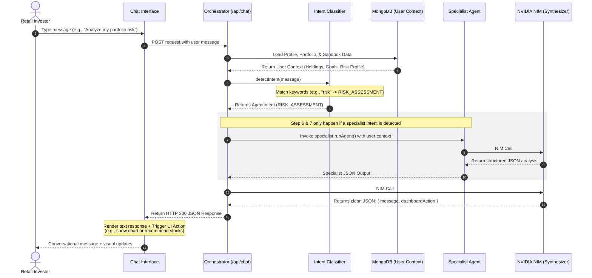

# 📈 FinNext Multi-Agent AI Orchestration Architecture
> **Comprehensive Guide for Explaining the FinNext Multi-Agent AI Assistant**

This document provides a detailed, technical, and conceptual breakdown of the Multi-Agent AI system implemented in **FinNext**. You can use this guide directly for your project documentation, presentation slides, or viva preparation.

---

## 🧭 Architectural Design Philosophy
Instead of using heavy, opinionated agent frameworks (like LangChain, AutoGen, or CrewAI) which add significant latency, memory overhead, and dependency complexity, FinNext utilizes a **custom, lightweight, zero-dependency Orchestrator** built in pure TypeScript.

The system leverages **NVIDIA NIM APIs** (specifically `nvidia/nemotron-3-nano-30b-a3b` or equivalent high-speed NIMs) to execute structured specialist tasks and synthesize the final user-facing response.

### Core Pipeline Flow
When a user types a message in the chat bar, the system processes it in five distinct phases:



---

## ⚡ 1. The Gateway: Intent Classifier
Located in [`lib/agents/intentClassifier.ts`](file:///d:/FinTech/Finance/lib/agents/intentClassifier.ts), the Intent Classifier is a **zero-latency, regex-based router**. It inspects the incoming user message for key financial terms and maps it to a specialist agent before any LLM call is made. 

* **Why?** Passing every message through an LLM just to classify intent adds 1–2 seconds of latency and wastes API credits. A regex-based classifier executes in **0 milliseconds**.
* **Intent Mapping Table:**

| Regex Keywords Detected | Detected Intent | Target Specialist Agent |
| :--- | :--- | :--- |
| `risk`, `volatile`, `beta`, `safe`, `danger`, `exposure`, `drawdown`, `sharpe`, `hedge` | `RISK_ASSESSMENT` | **Risk Agent** |
| `forecast`, `predict`, `prediction`, `outlook`, `30-day`, `future price`, `projection` | `FORECAST` | **Forecast Agent** |
| `sentiment`, `news`, `feeling`, `mood`, `buzz`, `narrative`, `analyst`, `public opinion` | `MARKET_SENTIMENT` | **Sentiment Agent** |
| `screen`, `find stocks`, `filter`, `value stock`, `growth stock`, `criteria`, `undervalued` | `SCREENER` | **Screener Agent** |
| `recommend`, `suggest`, `should i buy/sell`, `best stock`, `top pick`, `entry/exit point` | `RECOMMENDATION` | **Recommendation Agent** |
| `portfolio`, `diversif`, `allocation`, `holding`, `sector`, `rebalanc`, `weight`, `concentration` | `PORTFOLIO_ANALYSIS` | **Portfolio Agent** |
| *(No keyword match)* | `GENERAL` | **Direct Synthesis (Pure Conversational)** |

---

## 🤖 2. The 7 Specialized Agents

Each agent is designed to execute a narrow, structured task. They receive a **Specialist System Prompt** that forces them to respond **only** in valid JSON.

---

### Agent 1: Screener Agent
* **File Location:** [`app/api/agents/screener/route.ts`](file:///d:/FinTech/Finance/app/api/agents/screener/route.ts)
* **Use Case:** Filters and ranks stocks based on user's investment goals (growth, income, value) and risk profile.
* **Inputs:** `criteria` (risk tolerance, investment goals), `marketData` (optional).
* **System Prompt:**
  ```text
  You are an equity screener AI for FinNext. Based on the user's risk tolerance and goals, 
  screen for suitable stocks from well-known equities and return ONLY a JSON object...
  Return between 4 and 6 stocks. Return ONLY valid JSON, no markdown fences, no preamble.
  ```
* **JSON Output Schema:**
  ```json
  {
    "screeningCriteria": { "riskTolerance": "MEDIUM", "goal": "GROWTH" },
    "results": [
      {
        "ticker": "MSFT",
        "company": "Microsoft Corp.",
        "sector": "Technology",
        "whyItFits": "Solid earnings growth combined with strong enterprise cloud moat, matching medium risk growth goals.",
        "riskRating": "MEDIUM",
        "growthPotential": "HIGH"
      }
    ],
    "excludedCategories": ["Penny Stocks", "Highly Leveraged Real Estate"],
    "summary": "Screened 5 enterprise-grade stocks matching a medium-risk growth profile with strong balance sheets."
  }
  ```

---

### Agent 2: Sentiment Agent
* **File Location:** [`app/api/agents/sentiment/route.ts`](file:///d:/FinTech/Finance/app/api/agents/sentiment/route.ts)
* **Use Case:** Performs text analysis of market headlines, earnings calls, and news volume to produce a score.
* **Inputs:** `tickers` (symbols list), `newsHeadlines` (raw string array).
* **System Prompt:**
  ```text
  You are a market sentiment analyst for FinNext. Analyze news headlines and ticker activity 
  to produce a sentiment summary. Return JSON: { overallSentiment, tickerSentiments: [{ ticker, score, reason }], marketMood }
  ```
* **JSON Output Schema:**
  ```json
  {
    "overallSentiment": "BULLISH",
    "sentimentScore": 72,
    "tickerSentiments": [
      {
        "ticker": "AAPL",
        "score": 80,
        "reason": "Strong positive reception to new product announcements and dividend hike in recent press releases."
      }
    ],
    "marketMood": "Optimistic with minor inflation anxieties",
    "keyThemes": ["AI hardware cycle", "Stable consumer demand"],
    "riskEvents": ["Upcoming federal interest rate decision"],
    "summary": "Overall market sentiment is bullish, driven by strong tech hardware demand, though macroeconomic rate adjustments remain a key risk event."
  }
  ```

---

### Agent 3: Risk Agent
* **File Location:** [`app/api/agents/risk/route.ts`](file:///d:/FinTech/Finance/app/api/agents/risk/route.ts)
* **Use Case:** Calculates portfolio-wide risk metrics, beta exposure, and draws up protection/hedging ideas.
* **Inputs:** `portfolio` (array of holdings), `userProfile` (risk profile).
* **System Prompt:**
  ```text
  You are a financial risk analyst AI for FinNext. Evaluate the portfolio against the user's risk tolerance 
  and return ONLY a JSON object... Return ONLY valid JSON, no markdown fences, no preamble.
  ```
* **JSON Output Schema:**
  ```json
  {
    "riskScore": 6,
    "riskLevel": "MEDIUM",
    "volatilityRating": "MEDIUM",
    "betaEstimate": 1.12,
    "sharpeEstimate": 1.45,
    "isAlignedWithProfile": true,
    "topThreats": [
      "Overconcentration in high-beta tech stocks",
      "Sensitivity to interest rate decisions"
    ],
    "hedgingSuggestions": [
      "Allocate 10% to defensive dividend paying consumer staples",
      "Purchase near-term put options on the Nasdaq index if volatility spikes"
    ],
    "summary": "Your portfolio holds a moderate risk level with a beta of 1.12. It aligns well with your medium-risk tolerance, though adding defensive assets could reduce tech exposure."
  }
  ```

---

### Agent 4: Recommendation Agent
* **File Location:** [`app/api/agents/recommendation/route.ts`](file:///d:/FinTech/Finance/app/api/agents/recommendation/route.ts)
* **Use Case:** Generates highly tailored Buy/Sell/Hold recommendations.
* **Inputs:** `portfolio` (holdings list), `riskProfile`, `goals`.
* **System Prompt:**
  ```text
  You are a holistic investment recommendation AI for FinNext. Based on the user's profile and current holdings, 
  generate specific buy/sell/hold recommendations and return ONLY a JSON object...
  ```
* **JSON Output Schema:**
  ```json
  {
    "recommendations": [
      {
        "ticker": "GOOGL",
        "action": "BUY",
        "conviction": "HIGH",
        "rationale": "Undervalued relative to long-term generative AI advertising revenue stream.",
        "targetEntry": "₹165 - ₹170",
        "stopLoss": "₹150"
      }
    ],
    "portfolioGaps": ["Underrepresented in Health Care and Energy sectors"],
    "avoidSectors": ["Speculative Biotech", "Highly cyclical real estate"],
    "summary": "We recommend establishing a BUY stance on Alphabet due to undervaluation, and adding defensive exposure to balance out the technology sector dominance."
  }
  ```

---

### Agent 5: Portfolio Agent
* **File Location:** [`app/api/agents/portfolio/route.ts`](file:///d:/FinTech/Finance/app/api/agents/portfolio/route.ts)
* **Use Case:** Assesses diversification and creates sector mappings and rebalancing recommendations.
* **Inputs:** `portfolio` (holdings list).
* **System Prompt:**
  ```text
  You are an elite portfolio analysis AI for FinNext. Analyze the user's stock portfolio and provide:
  1. Diversification score (0-100)
  2. Sector allocation breakdown (%)
  3. Top 3 concentration risks
  4. Rebalancing recommendations
  Output as structured JSON: { score, sectors, risks, recommendations }
  ```
* **JSON Output Schema:**
  ```json
  {
    "score": 68,
    "sectors": [
      { "name": "Technology", "percent": 55 },
      { "name": "Finance", "percent": 25 },
      { "name": "Consumer Goods", "percent": 20 }
    ],
    "risks": [
      "Technology sector concentration exceeds 50%",
      "Lack of small-cap growth assets"
    ],
    "recommendations": [
      "Trim technology holdings by 10% to lock in gains",
      "Redistribute trimmed cash into index funds or consumer defensive stocks"
    ],
    "summary": "Your portfolio is moderately diversified with a score of 68. The primary vulnerability is heavy technology concentration, which leaves you exposed to sector-wide corrections."
  }
  ```

---

### Agent 6: Forecast Agent
* **File Location:** [`app/api/agents/forecast/route.ts`](file:///d:/FinTech/Finance/app/api/agents/forecast/route.ts)
* **Use Case:** Computes 30-day projection intervals based on historical price data points.
* **Inputs:** `ticker` (string symbol), `historicalData` (90 days of OHLCV coordinates).
* **System Prompt:**
  ```text
  You are a quantitative forecasting AI for FinNext. Based on historical price data and market trends, 
  generate a 30-day price forecast corridor. Return JSON: { ticker, forecastDays: [{ day, low, mid, high }], confidence, keyDrivers }
  ```
* **JSON Output Schema:**
  ```json
  {
    "ticker": "AAPL",
    "marketOutlook": "BULLISH",
    "confidence": "HIGH",
    "perTicker": [
      {
        "ticker": "AAPL",
        "currentTrend": "UP",
        "thirtyDayOutlook": "BULLISH",
        "keyLevels": { "support": "₹180", "resistance": "₹198" },
        "keyDrivers": ["Increasing services segment margins", "Optimistic institutional purchase blocks"]
      }
    ],
    "macroFactors": ["Federal interest rate stabilization", "Consumer demand indexes"],
    "summary": "Apple exhibits a short-term upward trend. Key resistance sits at ₹198 with support holding firm at ₹180, backed by growing services revenue."
  }
  ```

---

### Agent 7: Depth Report Agent
* **File Location:** [`app/api/agents/depth-report/route.ts`](file:///d:/FinTech/Finance/app/api/agents/depth-report/route.ts)
* **Use Case:** Functions as a portfolio supervisor and risk auditor. It performs a comparison between the user's **real portfolio** and **virtual sandbox** positions to generate a unified depth audit.
* **Inputs:** User's complete DB profile, real portfolio holdings, and active sandbox positions.
* **System Prompt:**
  ```text
  You are a world-class portfolio manager and financial risk auditor powered by FinNext AI.
  Analyze the user's real portfolio and virtual sandbox positions, and generate a comprehensive depth report.
  Provide comparison, diversification analysis, combined risk metrics, and rebalancing ideas.
  ```
* **JSON Output Schema:**
  ```json
  {
    "portfolioScore": 78,
    "sandboxScore": 85,
    "combinedScore": 81,
    "riskAssessment": {
      "portfolioRisk": "MEDIUM",
      "sandboxRisk": "HIGH",
      "combinedRisk": "MEDIUM-HIGH",
      "description": "Your real portfolio is well-balanced, but your sandbox trades are highly concentrated in high-beta tech, elevating the combined risk profile."
    },
    "comparison": {
      "portfolioValue": 1250000,
      "sandboxValue": 100000,
      "portfolioHoldingsCount": 5,
      "sandboxHoldingsCount": 3,
      "keyDifference": "Real portfolio focuses on long-term compound growth, whereas the sandbox uses active swing trading in large cap technology."
    },
    "sectorAllocation": [
      { "sector": "Technology", "portfolioPercent": 40, "sandboxPercent": 60, "status": "OVERWEIGHT" }
    ],
    "topRisks": [
      { "risk": "Tech Overconcentration", "severity": "HIGH", "recommendation": "Consider moving some sandbox profits to defensive sectors like Consumer Staples." }
    ],
    "opportunities": [
      { "opportunity": "High Virtual P&L in Finance", "action": "Your sandbox performance shows strong timing in financial stocks. Consider adding HDFC Bank to your real portfolio." }
    ],
    "recommendations": [
      "Trim high-beta sandbox assets and move gains to test hedges",
      "Deploy sandbox strategies to real assets selectively"
    ]
  }
  ```

---

## 🎨 3. The Orchestration & Synthesis Engine
The main coordinator lives in [`app/api/chat/route.ts`](file:///d:/FinTech/Finance/app/api/chat/route.ts). It performs two critical functions:
1. **RAG Context Assembly:** Fetches profile parameters, real holdings, and sandbox trades from MongoDB and serializes them into a highly compact text block.
2. **Synthesis & Action Generation:** Feeds the user context and the specialist agent's output into a second LLM prompt (**`SYNTHESIZER_PROMPT`**). This prompt commands the LLM to output a single JSON object containing:
   - A friendly, conversational chat message summarizing the data.
   - An actionable **`dashboardAction`** that the frontend UI automatically intercepts and executes.

### Example Dashboard Actions Triggered by the AI
* **`RECOMMEND_STOCKS`** (e.g., `payload = ["AAPL", "MSFT"]`): Highlights recommended tickers in the stock selector.
* **`SANDBOX_TRADE`** (e.g., `payload = { ticker: "AAPL", action: "BUY", quantity: 10 }`): Automatically pre-fills a mock order form for the user to confirm with a single click.
* **`SHOW_CHART`** (e.g., `payload = { ticker: "AAPL", period: "1M" }`): Automatically scrolls and snaps the live TradingView widget to AAPL.

---

## 🛡️ 4. Enterprise-Grade Engineering Highlights

### 1. Robust JSON Sanitization & Parsing
LLMs can be unpredictable. Sometimes they output markdown blocks like:
````text
```json
{
  "portfolioScore": 75,
  ...
}
```
````
If a server directly calls `JSON.parse` on this, it throws an error. FinNext handles this defensively:
```typescript
const clean = rawText.replace(/```json|```/g, "").trim();
const parsed = JSON.parse(clean);
```
If the output is completely mangled, the system degrades gracefully by delivering the raw string as a plain conversational chat message without crashing the UI.

### 2. Dual-Engine Execution (Local Audit Engine Fallback)
For the **Depth Report Agent**, if the NVIDIA NIM API key is missing, rate-limited, or throws an error, the agent doesn't crash the application. It switches automatically to a **high-performance local audit engine**. This compiler:
1. Computes active values, holdings counts, and sector allocations directly from the database query.
2. Applies a mathematical heuristic to score real holdings and virtual positions.
3. Compiles a complete, valid JSON Depth Report directly on the Next.js server with **0ms external API latency**.

---

## 💡 Key Talking Points for Presentations

When describing your part of the project, emphasize these **high-value engineering terms**:
1. **"Decoupled Specialist Agent Pattern"**: We separate concerns. Rather than having one large model try to do everything (which causes hallucinations), we run narrow, specialized agents (Screener, Risk, Forecast, etc.) that output structured JSON, then synthesize them at the end.
2. **"Zero-Latency Intent Classifier"**: Explain how keyword regex routers save unnecessary API network trips, resulting in a snappier user interface.
3. **"Direct Database-backed RAG (Retrieval-Augmented Generation)"**: The model answers questions with full, real-time context of the user's actual profile, real holdings, and active paper-trading sandbox positions.
4. **"API-Driven UI Mutations"**: The Synthesizer doesn't just output text; it outputs structured actions (`dashboardAction`) that drive client-side interactions in real-time, matching the conversational flow.
5. **"Graceful Local Fallback Compiler"**: Highlight that the Depth Report agent has an offline fallback algorithm that runs local portfolio mathematics if the LLM provider fails, ensuring uninterrupted uptime.
